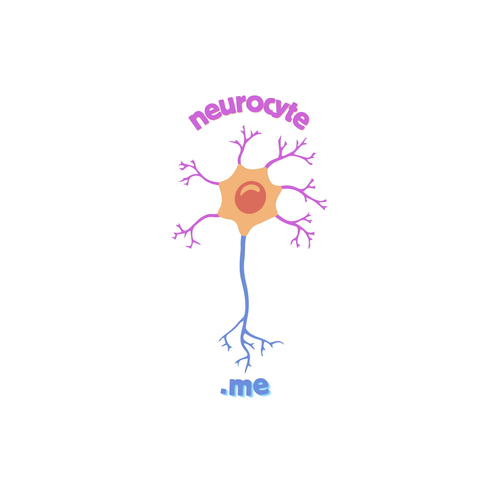

# neurocyte.me

<p align="center">
	
</p>

**neurocyte.me** is an advanced neurology patient management platform designed to help neurologists track disease progression, manage medical records, and utilize AI-driven insights for better treatment planning.

---

## 🚀 Features

- **Comprehensive Patient Records** – Store and manage patient details, medical history, and diagnostic information.
- **Disease Progression Tracking** – Monitor symptoms, treatment effectiveness, and functional assessments over time.
- **Medical Document Management** – Upload and export PDFs, Word files, or CSV reports, including MRI, CT, and EEG findings.
- **AI-Powered Insights** – Receive treatment suggestions and predictive analytics based on historical patient data.
- **Device Synchronization** – Connect with medical devices (e.g., EEG) and wearable health trackers for real-time data analysis.
- **Hospital System Integration** – Ensure compatibility with healthcare standards like HL7/FHIR.
- **Clinical Trial Candidate Identification** – Flag patients meeting criteria for research studies.
- **Automated Report Generation** – Create detailed medical reports with charts and statistics in PDF format.

---

## 🛠️ Tech Stack

- **Frontend:** React.js, TypeScript
- **Backend:** NestJS, Node.js
- **Database & Integrity:** *[e.g., PostgreSQL, Prisma — feel free to fill in]*

---

## 📦 Installation & Setup

This repository contains both the frontend application and the backend service. 

### 1. Prerequisites
Ensure you have **Node.js** (v18+ recommended) and npm/yarn installed.

### 2. Backend Setup
Navigate to the backend directory, install dependencies, and start the service:
```sh
cd backend
npm install
npm run start:dev

